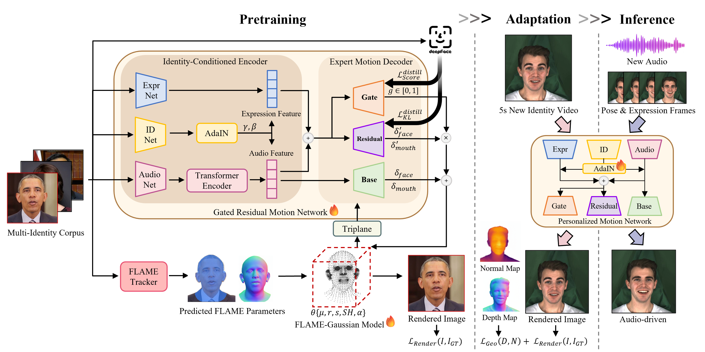

<div align="center">

# EmoTaG: Emotion-Aware Talking Head Synthesis on Gaussian Splatting with Few-Shot Personalization

**Official repository for our CVPR 2026 paper**

[](https://arxiv.org/pdf/2603.21332)
[](https://arxiv.org/abs/2603.21332)
[](https://emotag26.github.io/)

<br>

<br><br>

## 🚀 Code will be released to the public soon!

</div>

## 📝 To-Do List

- [ ] Release inference code and pre-trained models
- [ ] Release few-shot personalization (adaptation) code
- [ ] Release pre-training code
- [ ] Release data processing scripts

## 📖 Citation

Consider citing as below if you find this repository helpful to your project:

```bibtex
@inproceedings{xu2026emotag,
  title={EmoTaG: Emotion-Aware Talking Head Synthesis on Gaussian Splatting with Few-Shot Personalization},
  author={Xu, Haolan and Cheng, Keli and Wang, Lei and Bi, Ning and Liu, Xiaoming},
  booktitle={Proceedings of the IEEE/CVF Conference on Computer Vision and Pattern Recognition},
  year={2026}
}
```
