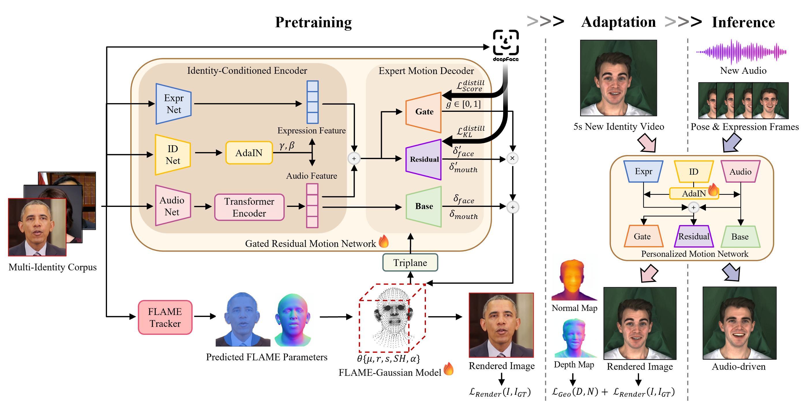

<div align="center">

# EmoTaG: Emotion-Aware Talking Head Synthesis<br>with Gaussian Splatting

<p>
  <a href="https://arxiv.org/abs/2603.21332"></a>
  <a href="https://emotag26.github.io/"></a>
  <a href="https://www.youtube.com/watch?v=kEPHIu8I7HE"></a>
</p>

Official implementation of **EmoTaG** (CVPR 2026).



</div>

---

## Installation

> Tested on **Ubuntu 22.04** with **CUDA 12.1** and **PyTorch**.

### 1. Clone the repository and create the environment

```bash
git clone https://github.com/jamesdemon923/EmoTaG.git
cd EmoTaG
git submodule update --init --recursive

conda env create --file environment_cu121.yml
conda activate emotag
```

### 2. Install PyTorch3D and project submodules

```bash
pip install "git+https://github.com/facebookresearch/pytorch3d.git"
pip install -e submodules/simple-knn
pip install -e gridencoder
pip install -e shencoder
```

The renderer uses the depth/normal/alpha-capable rasterizer
[`diff_gauss`](https://github.com/slothfulxtx/diff-gaussian-rasterization):

```bash
git clone --recursive https://github.com/slothfulxtx/diff-gaussian-rasterization.git
pip install ./diff-gaussian-rasterization
```

### 3. Third-party resources

| Resource | Purpose |
| :--- | :--- |
| [FLAME](https://flame.is.tue.mpg.de/index.html) | FLAME parametric head model |
| [VHAP](https://github.com/ShenhanQian/VHAP) | FLAME tracking environment |
| [Wav2Vec2](https://huggingface.co/facebook/wav2vec2-base-960h) | Audio feature extraction backbone |
| [py-feat](https://py-feat.org/) | Action Unit (AU) feature extraction |
| [DeepFace](https://github.com/serengil/deepface) | Per-frame emotion features |
| [CVLface](https://github.com/mk-minchul/CVLface) | Identity embedding |
| [Sapiens](https://github.com/facebookresearch/sapiens/blob/main/lite/README.md) | Depth and normal priors for adaptation |

Export the FLAME / VHAP paths used by the preprocessing tools:

```bash
export EMOTAG_FLAME_MODEL=/path/to/flame/generic_model.pkl
export EMOTAG_VHAP_ROOT=/path/to/VHAP
```

---

## Datasets

EmoTaG is trained and evaluated on two public talking-head corpora:

| Dataset | Role | Subset used by EmoTaG |
| :--- | :--- | :--- |
| [HDTF](https://github.com/MRzzm/HDTF) | Multi-identity pre-training | 70 videos (one identity each, 90–240 s) sampled from HDTF, to learn the identity-agnostic audio-motion prior. |
| [MEAD](https://wywu.github.io/projects/MEAD/MEAD.html) | Emotional evaluation | A subset of 5 emotions × 3 intensity levels (2 identities per emotion) from MEAD, for the emotional / emotion-intensity tests. |

Please obtain both datasets from their official sources and follow their
respective licenses. All clips are face-centered cropped and resized to
**512 × 512 at 25 FPS** before processing.

---

## Data Preparation

A **processed scene** contains calibrated images, FLAME tracking, Gaussian
initialization, audio features, AU features, the emotion teacher, and the
identity descriptor. `tools/preprocess_scene.sh` runs all steps below for one
scene; add `RUN_SAPIENS=1` for adaptation (target) scenes:

```bash
EMOTAG_FLAME_MODEL=/path/to/FLAME/generic_model.pkl \
VHAP_EXPORT=/path/to/VHAP/export/<ID> \
WAV=data/<ID>/aud.wav \
CVLFACE_ROOT=/path/to/CVLface \
bash tools/preprocess_scene.sh data/<ID>
```

The steps below document what each stage produces if you prefer to run them
individually.

<details>
<summary><b>Expected directory layout</b></summary>

```text
data/<ID>/
├── transforms.json
├── flame_params.npz
├── model_center.npy
├── points3D.ply
├── face_indices.npy
├── bary_coords.npy
├── vertices.npy
├── mouth_point_indices.npy
├── aud_w2v.npy
├── au_features.csv
├── emotion_features.npy      
├── identity_feature.npy     
├── ori_imgs/
├── gt_imgs/
├── parsing/
├── torso_imgs/
└── sapiens/                 # for adaptation
```

</details>

### Step 1 — FLAME tracking with VHAP

Run the VHAP monocular pipeline, then convert the export to the EmoTaG scene layout:

```bash
python tools/import_vhap_export.py \
  --vhap_export /path/to/VHAP/export/monocular/<ID>_whiteBg_staticOffset \
  --output      data/<ID> \
  --flame_model_path "$EMOTAG_FLAME_MODEL" \
  --num_points 60000 \
  --link_mode  symlink
```

### Step 2 — Facial landmarks (FAN)

Per-frame 68-point landmarks (`ori_imgs/<id>.lms`) define the lip/mouth crops
that supervise the mouth Gaussians:

```bash
python tools/extract_landmarks.py --scene data/<ID>
# -> data/<ID>/ori_imgs/<id>.lms   shape [68, 2]
```

### Step 3 — Audio features (Wav2Vec2)

```bash
python tools/extract_wav2vec2_features.py \
  --wav        data/<ID>/aud.wav \
  --output     data/<ID>/aud_w2v.npy \
  --transforms data/<ID>/transforms.json
```

### Step 4 — AU features (py-feat)

The six AU channels (`AU01, AU04, AU05, AU06, AU07, AU45`) supply the upper-face
expression cues that audio cannot carry (`AU45` is clipped to `[0, 2]` at load
time, following Supp. Sec. B.2). Extract them with [py-feat](https://py-feat.org/):

```bash
python tools/extract_pyfeat_au.py --scene data/<ID>
# -> data/<ID>/au_features.csv
```

> An OpenFace-based alternative wrapper (`tools/extract_openface_au.sh`, needs a
> local OpenFace build via `OPENFACE_BIN`) is also provided; the released
> checkpoint was trained with the py-feat features above.

### Step 5 — Emotion teacher (DeepFace)

Run [DeepFace](https://github.com/serengil/deepface) per frame to obtain the
7-way emotion distribution used to supervise the emotion-aware branches:

```bash
python tools/extract_deepface_emotion.py --scene data/<ID>
# -> data/<ID>/emotion_features.npy   shape [N, 7]
#    columns = [angry, disgust, fear, happy, sad, surprise, neutral]
```

### Step 6 — Identity descriptor (CVLface)

Compute the identity descriptor `s` as the average face-recognition embedding
over the top-50 neutral frames (run Step 5 first so neutral frames can be
ranked). The extractor uses a [CVLface](https://github.com/mk-minchul/CVLface)
model; clone CVLface and point `--cvlface_root` at it (its pretrained models are
fetched under `<cvlface_root>/cvlface/pretrained_models`):

```bash
python tools/extract_adaface_identity.py \
  --scene         data/<ID> \
  --cvlface_root  /path/to/CVLface
# -> data/<ID>/identity_feature.npy   shape [512]
```

### Step 7 — Geometry priors (Sapiens)

> Not required for pre-training.

```bash
conda activate sapiens_lite
bash tools/run_sapiens_priors.sh data/<ID>
```

The script writes depth and normal maps under:

```text
data/<ID>/sapiens/
├── depth/sapiens_*/<frame_id>.npy
└── normal/sapiens_*/<frame_id>.npy
```

### Step 8 — Validate the scene

```bash
python tools/repro_check.py --root data/<ID> --imports
```

The checker reports whether each required scene file is present and valid.

---

## Training

### Pre-training (multi-identity)

```bash
python pretrain_emotag.py \
  -s data/pretrain \
  -m output/pretrain \
  --scene_names_file data/hdtf_pretrain_ids.txt \
  --audio_extractor wav2vec2 \
  --iterations 3600 \
  --warm_up_iter_per_scene 1000 \
  --w_flame_reg 1.0 \
  --batch_size 1
```

> `--iterations` is **per scene** (multiplied by the number of scenes
> internally), so `3600` over the 70 HDTF ids is the paper's ~250K-step budget.
> Full hyper-parameters are in
> [`configs/pretrain_hdtf70.yaml`](configs/pretrain_hdtf70.yaml); the EMA
> checkpoint is written to `output/pretrain/chkpnt_ema_face_latest.pth`.
> For multi-GPU, run `pretrain_emotag_ddp.py` with `torchrun` (same arguments).

### Few-shot adaptation (target identity)

```bash
python adapt_emotag.py \
  -s data/<ID> \
  -m output/<ID> \
  --audio_extractor wav2vec2 \
  --pretrain_path output/pretrain/chkpnt_ema_face_latest.pth \
  --iterations 20000 \
  --N_views 125 \
  --adapt_adain_only          
```

> `--adapt_adain_only` freezes the pretrained GRMN and tunes only the AdaIN
> modulation; optionally add `--adapt_unfreeze_heads` to also fine-tune the small
> FLAME/mouth prediction heads. Full hyper-parameters are in
> [`configs/adapt_5s.yaml`](configs/adapt_5s.yaml). `--pretrain_path` takes the
> multi-identity EMA checkpoint from the pre-training root.

### Pretrained checkpoint

To skip pre-training, download the multi-identity motion prior and adapt directly:

### 📦 [**Download checkpoint (Google Drive)**](https://drive.google.com/drive/folders/17wgFUGF7pxbW3QlBkiHQzo3nYTzF-fiN?usp=drive_link)

```bash
python adapt_emotag.py -s data/<ID> -m output/<ID> \
  --audio_extractor wav2vec2 \
  --pretrain_path /path/to/chkpnt_ema_face_latest.pth \
  --iterations 20000 --N_views 125 --adapt_adain_only
```

Trained on HDTF identities ([`data/hdtf_pretrain_ids.txt`](data/hdtf_pretrain_ids.txt))
with the recipe in [`configs/pretrain_hdtf70.yaml`](configs/pretrain_hdtf70.yaml).

---

## Inference

Render a trained scene:

```bash
python synthesize.py \
  -s data/<ID> \
  -m output/<ID> \
  --use_train
```

---

## Evaluation

### Video-level metrics

```bash
python evaluate_metrics.py video \
  output/<ID>/train/rendered_video.mp4 \
  output/<ID>/train/gt_video.mp4 \
  output/<ID>/train
```

### Action-Unit metrics (optional)

The AU error (AUE) compares AU intensities between the rendered and the
ground-truth videos. First run an AU extractor (see Step 3) on the **frames of
each video** to produce two CSVs, then:

```bash
python evaluate_metrics.py au \
  output/<ID>/train/rendered_au.csv \
  output/<ID>/train/gt_au.csv \
  --output_dir output/<ID>/train
```

## Acknowledgements

This code is developed upon [InsTaG](https://github.com/Fictionarry/InsTaG) and
[GaussianAvatars](https://github.com/ShenhanQian/GaussianAvatars). FLAME tracking
is from [VHAP](https://github.com/ShenhanQian/VHAP). Emotion and identity features
are obtained from [DeepFace](https://github.com/serengil/deepface) and
[CVLface](https://github.com/mk-minchul/CVLface). Geometry priors are from
[Sapiens](https://github.com/facebookresearch/sapiens). Thanks for these great projects!

---

## Responsible Use

EmoTaG is provided strictly for **research purposes**. Users are responsible for obtaining proper consent, complying with dataset licenses, and avoiding the creation of misleading or harmful synthetic media.

---

## Citation

If you find EmoTaG useful for your research, please consider citing:

```bibtex
@inproceedings{xu2026emotag,
  title     = {EmoTaG: Emotion-Aware Talking Head Synthesis on Gaussian Splatting with Few-Shot Personalization},
  author    = {Xu, Haolan and Cheng, Keli and Wang, Lei and Bi, Ning and Liu, Xiaoming},
  booktitle = {Proceedings of the IEEE/CVF Conference on Computer Vision and Pattern Recognition},
  year      = {2026}
}
```
